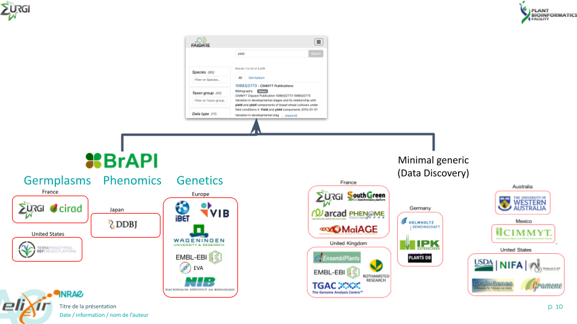

#### FAIDARE

<!-- Cyril P, first draft-->
[FAIDARE](https://urgi.versailles.inrae.fr/faidare/) [@https://urgi.versailles.inrae.fr/faidare] is a data discovery portal providing a biologist friendly search system over a global federation of 33 plant research databases. It allows a user to identify data resources using a full text search approach combined with domain specific filters. Each search result contains a link back to the original database for visualization, analysis, and download. The indexed data types are very broad and include genomic features, selected bibliography, QTL, markers, genetic variation studies, phenomic studies, and plant genetic resources. This inclusiveness is achieved thanks to a two stage indexation data model. The first, most generic, index provides basic search functionalities and relies on five fields: name, link back URL, data type, species, and exhaustive description. To provide more advanced filtering, the second stage indexation mechanism takes advantage of BrAPI endpoints to get more detailed metadata on genotyping and phenotyping studies. 

The indexation mechanism relies on a [public software package](https://github.com/elixir-europe/plant-brapi-etl-faidare) that allows data resource managers to request the indexation of their database. This BrAPI client is able to extract data from any BrAPI 1.3 and 1.2 endpoint. The development of BrAPI 2.x indexation will be initiated in 2025. Since not all databases are willing to implement BrAPI endpoints, we also provide the possibility to generate metadata as BrAPI compliant json files, using the standard as a file exchange format.

The FAIDARE architecture has been designed by elaborating on the GnpIS Software Architecture [@doi:10.34133/2019/1671403]. As a consequence, BrAPI is at the core of its data model. The JSON data files served by the Elasticsearch NoSQL engine are enriched versions of the BrAPI JSON data model. FAIDARE also includes a BrAPI endpoint that serves all indexed metadata. FAIDARE has been adopted by several communities including the ELIXIR and EMPHASIS european infrastructures, and the WheatIS of the Wheat-Initiative. Several databases are added each year to the FAIDARE global federation, allowing to increase both the portal and the BrAPI adoption.

<!-- {#fig:Schema_FAIDARE width="100%"} -->
